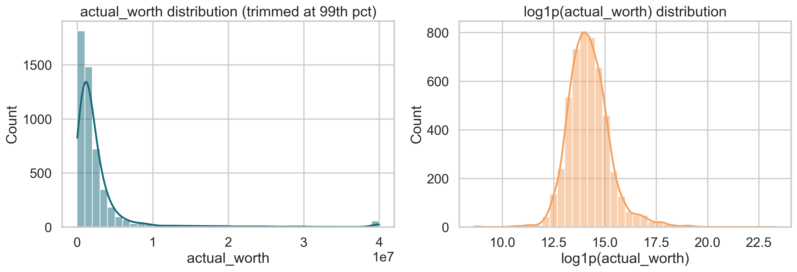
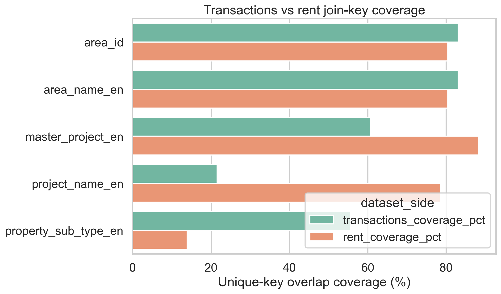
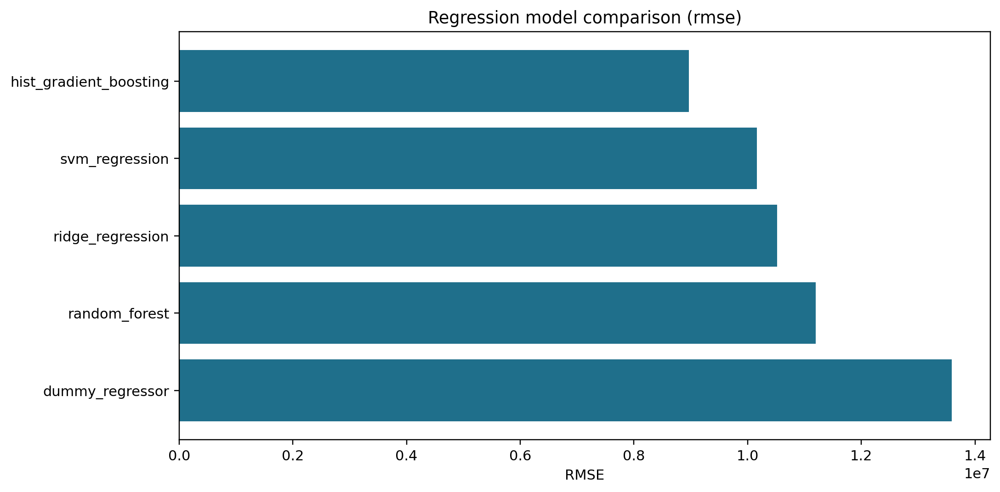
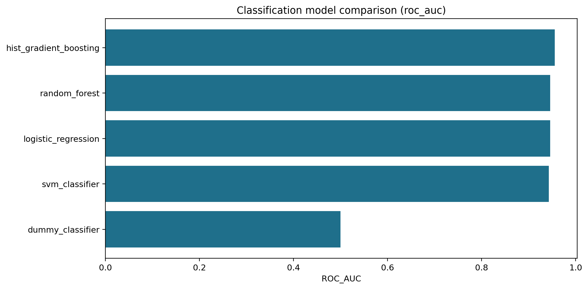
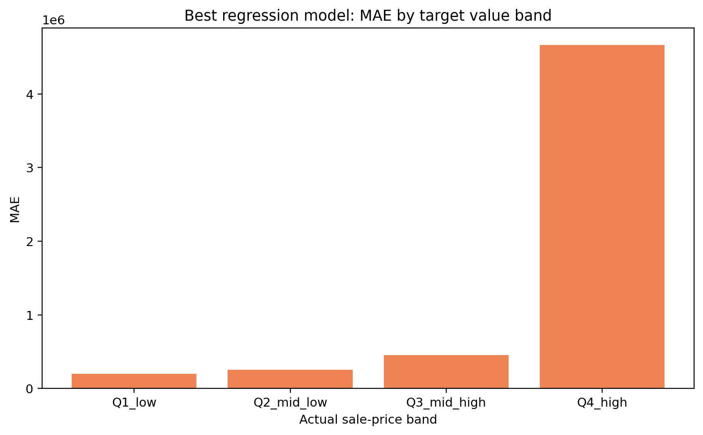

# ML7501 Real Estate Project

End-to-end applied machine learning project for predicting Dubai real-estate transaction value from raw Dubai Land Department data, enriched with rental-market context and annual hotel-sector indicators.

## Project Goal

This project was built for `ML 7501 - Applied Machine Learning`. The core supervised task is regression on `actual_worth`, using a realistic raw-data workflow instead of a toy benchmark. The pipeline direction is:

1. ingest and harmonize multiple public datasets
2. perform rigorous exploratory data analysis
3. engineer leak-free market-context features
4. compare multiple machine learning models
5. evaluate performance and explain the strongest results

## Repository Status

The repository now includes the full source pipeline:

- [src/appendix_analysis.py](src/appendix_analysis.py): appendix tables for search spaces, ablation, and raw-vs-log comparison
- [src/eda.py](src/eda.py): exploratory data analysis
- [src/modeling.py](src/modeling.py): master-table construction, preprocessing, model training, tuning, artifact export
- [src/evaluate_artifacts.py](src/evaluate_artifacts.py): rigorous post-training evaluation from saved artifacts
- [src/validate_data.py](src/validate_data.py): raw-data manifest and schema validation
- [reports/project_status.md](reports/project_status.md): concise project summary
- [data/README.md](data/README.md): local raw-data notes
- [reports/appendix_modeling_detail.md](reports/appendix_modeling_detail.md): exact search spaces, ablation table, and raw-vs-log target comparison

## Data Sources

The project uses three public-source datasets stored locally under `data/raw/`:

- Dubai Land Department transaction records
- Dubai rental contracts
- UAE hotel statistics used as annual macro context

The transaction table is the supervised master table. The rent table is used for area-time enrichment. The hotel table is only suitable as annual macro context, not neighborhood-level joining.

Exact source URLs, expected filenames, expected shapes, required columns, and the local reproduction hashes are tracked in [data/dataset_manifest.json](data/dataset_manifest.json).

For lower-friction smoke testing, the repository also includes a tracked lightweight sample in [data/sample](data/sample/README.md) together with its own [data/sample_manifest.json](data/sample_manifest.json).

## Exploratory Data Analysis

The EDA established the modeling direction and surfaced the main data risks:

- `actual_worth` is strongly right-skewed and contains major outliers
- rental/project fields are useful but sparse
- `meter_sale_price` is a leakage risk and should not be used directly for prediction
- `area_id` and time-based aggregation are more reliable join anchors than raw project names

### Target Distribution

The sale-price target has a heavy right tail, which supports testing log-transformed target variants and robust error analysis later in the pipeline.



### Join Feasibility

Transactions and rent records have strong overlap at `area_id` and `area_name_en`, but much weaker overlap at project-name level. That directly informs the feature-engineering strategy.



## Model Performance Snapshot

These metrics come from the strongest local experiment artifacts produced by the tracked source pipeline.

### Best Regression Result

- Model: `HistGradientBoostingRegressor`
- Test RMSE: `8,965,434.46`
- Test MAE: `1,394,204.91`
- Test R²: `0.5513`

Regression comparison:



### Best Classification Result

- Derived label: `is_high_value = 1` when `actual_worth >= 2,400,000`
- Model: `HistGradientBoostingClassifier`
- Test Accuracy: `0.8867`
- Test F1: `0.8323`
- Test ROC AUC: `0.9557`

Classification comparison:



### Error Concentration

The strongest regression model performs much worse on the highest-value band than on typical transactions. This matters for the final report because average metrics alone understate the difficulty of rare luxury deals.



## Conclusions So Far

1. Tree-based gradient boosting is the strongest model family for both regression and classification in the current experiments.
2. The problem is non-linear and interaction-heavy; size alone is not enough to explain property value.
3. Location and local market context add real predictive value, but they must be engineered carefully to avoid leakage.
4. Model quality is materially better on typical transactions than on the most expensive segment.
5. The EDA and early experiments support the original project hypothesis that non-linear ensemble methods should outperform simple linear baselines.

## Submission Appendix

For final-report polish, the repo includes a tracked appendix at [reports/appendix_modeling_detail.md](reports/appendix_modeling_detail.md) with:

- exact hyperparameter search spaces used by the tracked source
- a regression ablation table across structural, rent, hotel, and full feature sets
- an explicit raw-target versus `log1p`-target comparison

The key result from that appendix is that `log1p(actual_worth)` is clearly the correct target treatment for this problem, while the current coarse rent/hotel features still need refinement to beat the structural-location baseline.

## Repository Layout

```text
ML7501-Real-Estate-Proj/
├── README.md
├── requirements.txt
├── requirements-lock.txt
├── .gitignore
├── data/
│   ├── README.md
│   ├── dataset_manifest.json
│   ├── sample_manifest.json
│   ├── sample/               # tracked public sample for smoke runs
│   ├── schemas/              # tracked schema snapshots
│   └── raw/                  # local raw files, not versioned
├── docs/
│   ├── README.md
│   ├── course/               # local course brief reference
│   ├── proposal/             # local proposal reference
│   └── figures/              # tracked summary figures used in the README
├── reports/
│   ├── project_status.md
│   └── appendix_modeling_detail.md
├── src/
│   ├── __init__.py
│   ├── appendix_analysis.py
│   ├── eda.py
│   ├── evaluate_artifacts.py
│   ├── modeling.py
│   └── validate_data.py
└── outputs/                  # local generated artifacts, not versioned
```

## Setup

```bash
python3 -m pip install -r requirements.txt
```

For the exact package versions used in the tracked local reproduction snapshot:

```bash
python3 -m pip install -r requirements-lock.txt
```

## Reproducibility Checklist

1. Download the raw data files from the source URLs in [data/dataset_manifest.json](data/dataset_manifest.json).
2. Place them in `data/raw/` using the exact filenames listed in the manifest.
3. Validate the local files before running the pipeline:

```bash
python3 -m src.validate_data
```

For exact hash matching against the tracked local snapshot:

```bash
python3 -m src.validate_data --strict-hash
```

For the tracked sample instead of the full raw snapshot:

```bash
python3 -m src.validate_data --data-dir data/sample
```

## Run The Current EDA

```bash
python3 -m src.eda
```

This generates summary tables and plots under `outputs/eda/`.

Run EDA on the tracked sample:

```bash
python3 -m src.eda --data-dir data/sample --output-dir outputs/eda_sample
```

## Generate The Appendix Tables

```bash
python3 -m src.appendix_analysis --artifact-dir outputs/modeling/gpu_run --output-dir outputs/reporting/appendix
```

## Run The End-to-End Modeling Pipeline

Train the full regression and classification pipeline and save artifacts:

```bash
python3 -m src.modeling --task both --output-dir outputs/modeling/latest
```

Optional GPU-backed run when `xgboost` is installed:

```bash
python3 -m src.modeling --task both --use-gpu --output-dir outputs/modeling/gpu_run
```

Important options:

- `--train-frac 0.70`
- `--val-frac 0.15`
- `--classification-quantile 0.75`
- `--tune-iterations 8`
- `--cv-splits 4`
- `--n-jobs 1`

Sample smoke run:

```bash
python3 -m src.modeling --data-dir data/sample --task regression --tune-iterations 1 --cv-splits 3 --output-dir outputs/modeling/sample_smoke
```

## Run Artifact Evaluation

Evaluate a saved artifact directory and generate enriched metrics, subgroup analysis, and summary plots:

```bash
python3 -m src.evaluate_artifacts \
  --artifact-dir outputs/modeling/gpu_run \
  --output-dir outputs/evaluation/gpu_run \
  --bootstrap-iterations 250
```

Evaluate the tracked sample smoke artifacts:

```bash
python3 -m src.evaluate_artifacts \
  --artifact-dir outputs/modeling/sample_smoke \
  --output-dir outputs/evaluation/sample_smoke \
  --bootstrap-iterations 10
```

## Expected Outputs

After running the full pipeline, the main local outputs are:

- `outputs/modeling/<run_name>/tables/`
- `outputs/modeling/<run_name>/plots/`
- `outputs/modeling/<run_name>/models/`
- `outputs/modeling/<run_name>/summaries/`
- `outputs/evaluation/<run_name>/tables/`
- `outputs/evaluation/<run_name>/plots/`
- `outputs/evaluation/<run_name>/summaries/`

## Notes

- Raw data are intentionally excluded from git.
- The repo includes a tracked public sample and tracked schema snapshots to reduce reproduction friction for instructors.
- Large generated experiment artifacts remain local under `outputs/`.
- The repository is structured so the full end-to-end source code is tracked, while heavyweight local outputs stay untracked.
